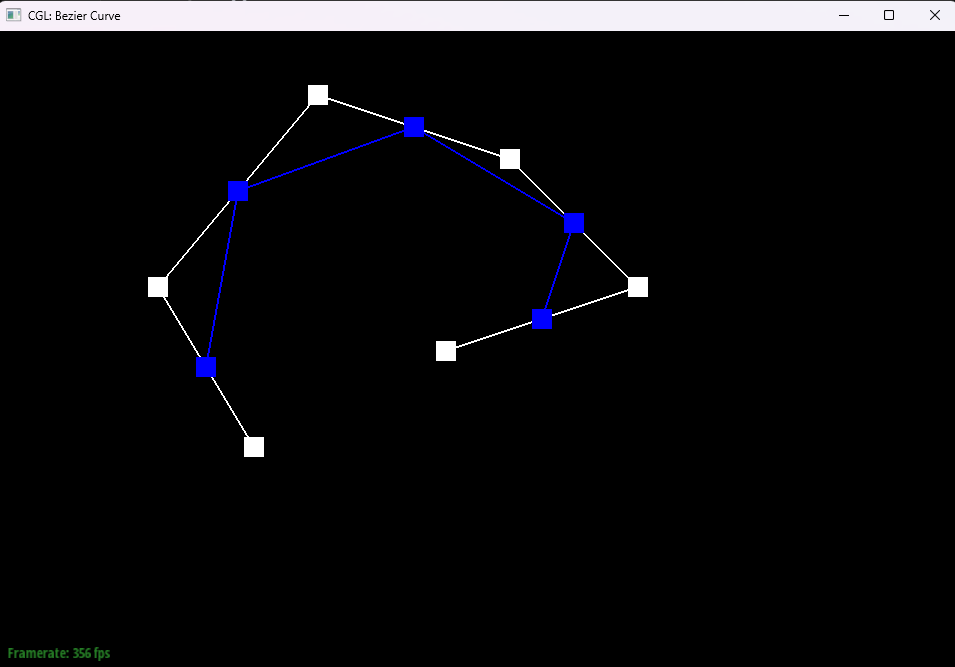

# Task 1: Bezier Curves with 1D de Casteljau Subdivision

## Overview

This task implements 1D de Casteljau subdivision for Bezier curves. 

## Implementation
De Casteljau’s algorithm evaluate Bézier curves at a parameter t by repeated linear interpolation of the control points:P0 to Pn. In the single step, we take all the current points as an input and compute new interpolated points by using the formula(1-t)pi+ tpi+1. So by repeating the step recursively, we can get interpolated points until only one point left.

## Screenshots

