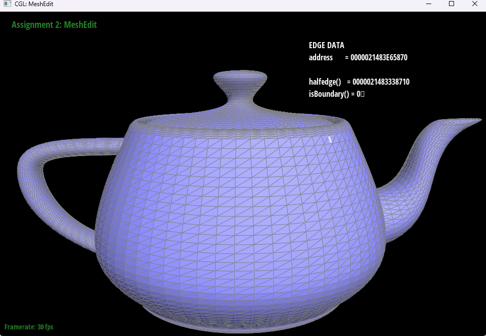

# Task 2: Bezier Surfaces with Separable 1D de Casteljau

## Overview

Extend the Bezier curve implementation to Bezier surfaces using separable 1D de Casteljau algorithm. This involves evaluating curves along u and v parameters to generate smooth surfaces.

## Implementation
The de Casteljau algorithm extends to Bézier surfaces by performing recursive linear interpolation in two dimensions. To evaluate a point on a Bézier surface at parameters 
(u,v), we first apply the de Casteljau algorithm along one direction using parameter u, collapsing each row of control points into a single point. This results in a 1D array of intermediate points. We then apply the same algorithm along the other direction using parameter v to interpolate among the intermediate points and obtain the final point on the surface.   
In the implementation, evaluateStep performs one level of interpolation between adjacent 3D points, while evaluate1D recursively calls evaluateStep until a single point remains. The evaluate(u, v) function first reduces each row using evaluate1D with u, then reduces the resulting column using evaluate1D with v, producing the final surface point.

## Screenshots
