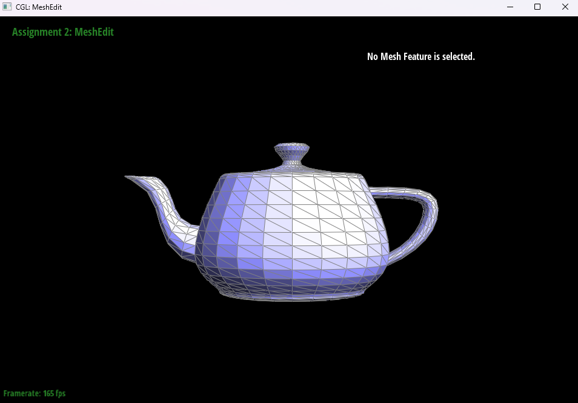

# Task 3: Area-Weighted Vertex Normals

## Overview
We implemented area-weighted vertex normals by iterating over all faces adjacent to a given vertex using the half-edge data structure. For each neighboring face, we retrieved its three vertex positions and computed the face normal using the cross product of two edge vectors. Since the magnitude of the cross product is proportional to the area of the triangle, summing these face normals effectively gives an area-weighted average. We accumulated these unnormalized normals and finally normalized the result to return a unit vector. This approach provides smooth per-vertex normals suitable for Phong shading.

## Screenshots

