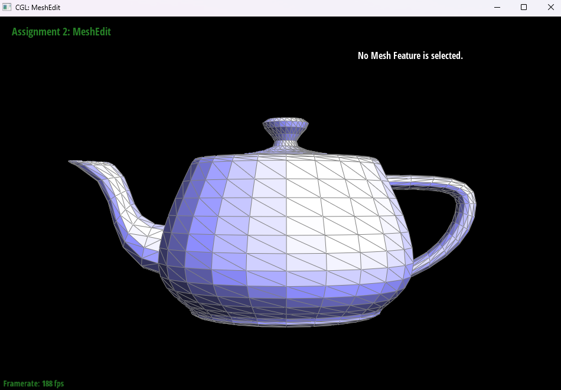
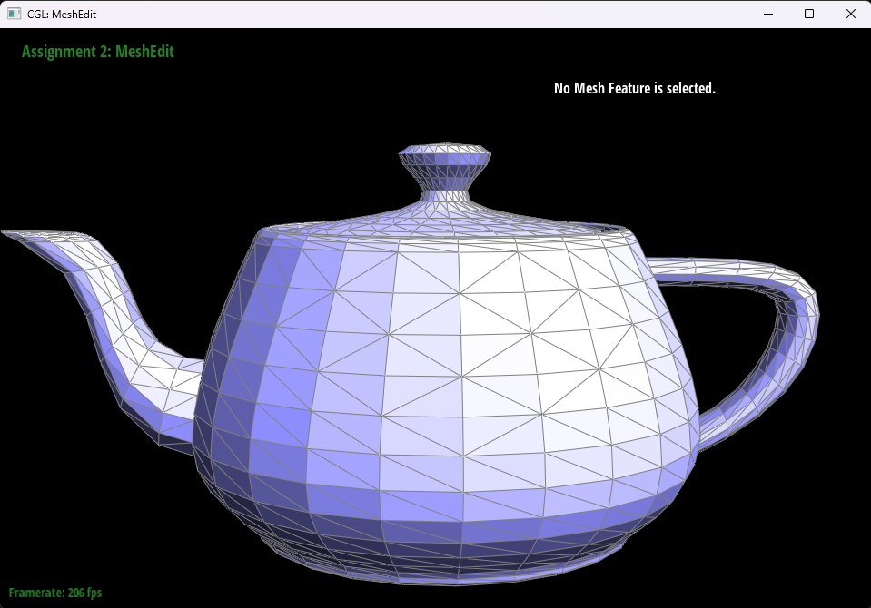

# Task 4: Edge Flip

## Overview

Implement edge flip operation to improve mesh quality. This operation allows for local mesh restructuring to reduce mesh distortion and improve rendering quality.

## implementation
The implementation of the edge‑flip function is by directly re‑wiring the half‑edge pointers around the chosen interior edge. First, gathering the six half‑edges (`h0…h5`), their twins, the four incident vertices (`v0…v3`), and the two adjacent faces (`f0,f1`). Then for each of the two triangles I called `setNeighbors(...)` to reassign each half‑edge’s `next`, `twin`, `vertex`, `edge`, and `face` pointers according to the flipped configuration. Finally, I updated each face’s `halfedge` reference and fixed any vertex’s `halfedge` pointer that still pointed at one of the two flipped half‑edges.  
The most difficult part is to keep track of all the pointers after the flip, so what we did is having a table recording the next, twin, vertex，edge, and face pointers.
## Screenshots

