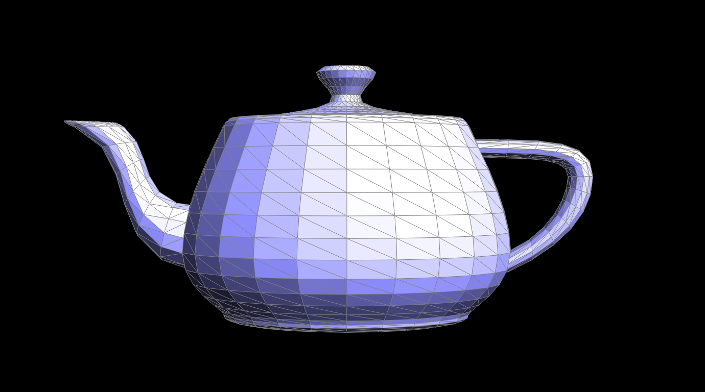
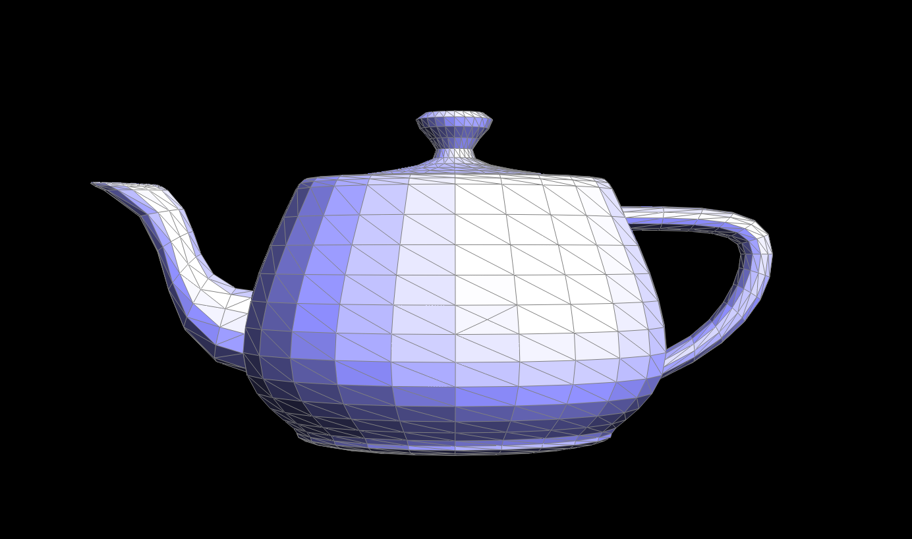
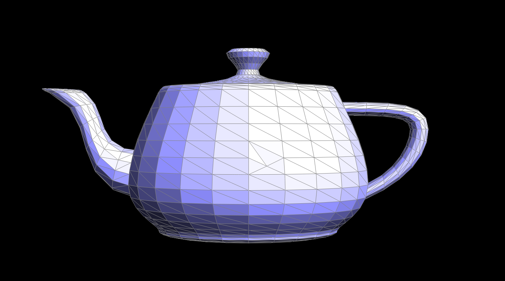
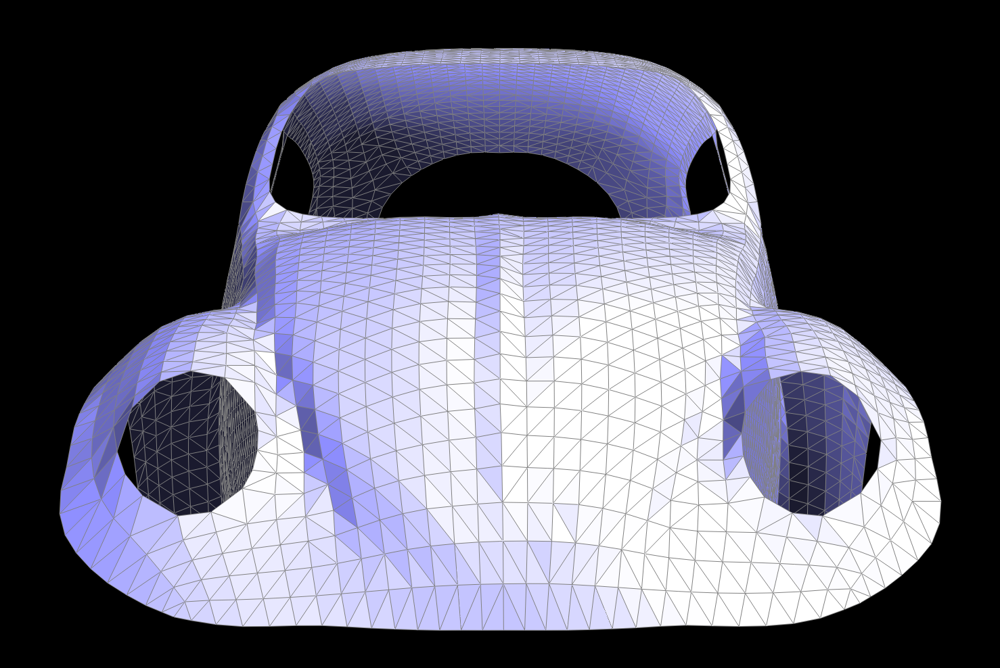
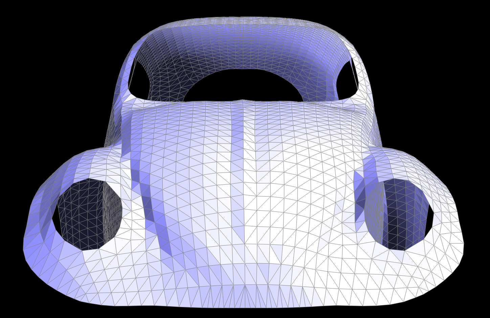

# Task 5: Edge Split

## Implementation

I implemented edge split by creating a new vertex at the edge midpoint and dividing adjacent faces into smaller triangles. The key steps are:

1. Collect existing halfedges, vertices, and faces around the target edge
2. Create new vertex at midpoint: `vm->position = 0.5 * (v0->position + v1->position)`
3. Create necessary new halfedges and edges
4. Reconnect topology using `setNeighbors()` calls
5. Handle boundary cases separately

## Key Tricks

### Boundary Detection

```cpp
bool h0_boundary = h0->isBoundary(), h1_boundary = h1->isBoundary();
```

This allows handling three cases: both interior faces, h0 boundary, or h1 boundary.

### Systematic Naming

- `hm0`, `hm1`: Halfedges from new vertex vm
- `h2m`, `hm2`: Halfedges connecting vm to v2
- `h3m`, `hm3`: Halfedges connecting vm to v3

## Debugging Challenges

1. **Face Connectivity**: Initially had issues with `next()` pointers not being properly updated
2. **Boundary Edges**: Required separate code paths for different boundary scenarios
3. **Vertex Pointers**: Forgot to update `vm->halfedge()` initially

## Screenshots

### Before and After Edge Split




### Edge Split + Edge Flip




### Boundary Edge Support



