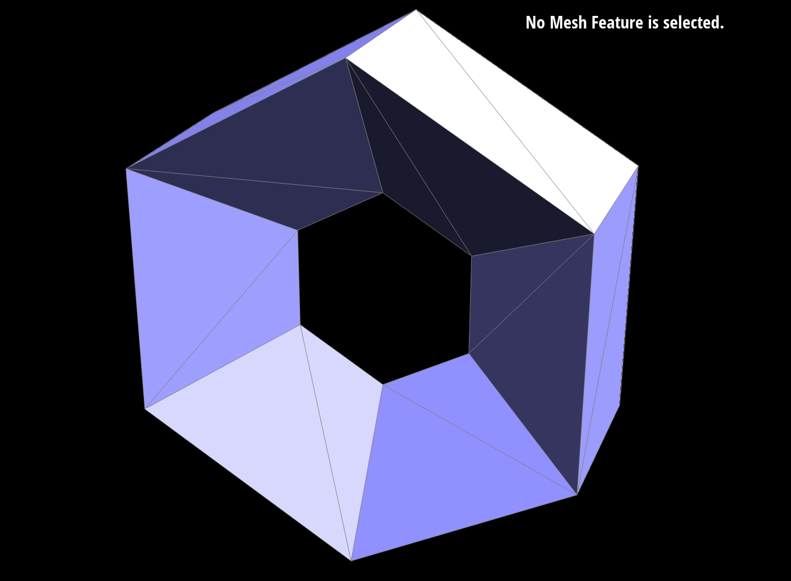
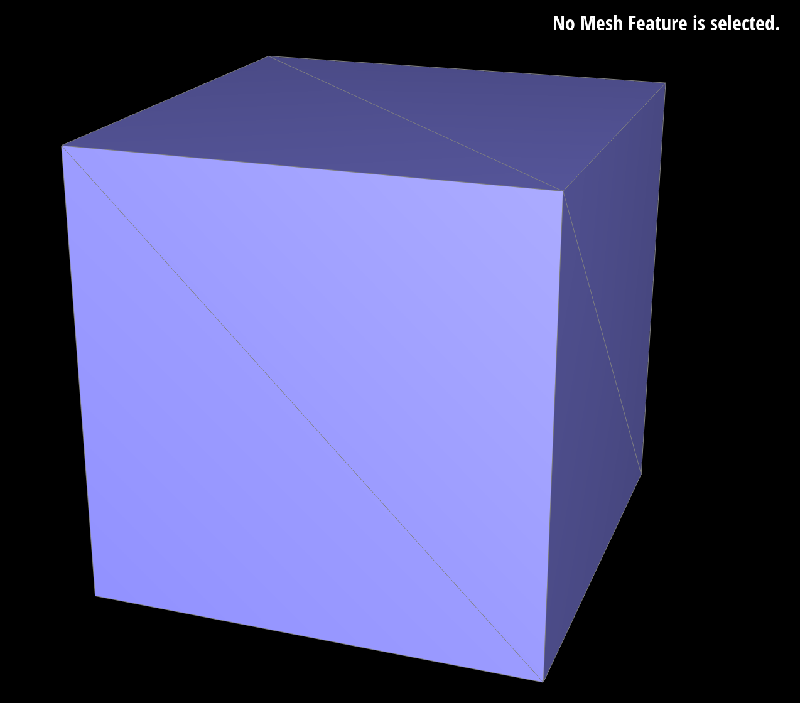
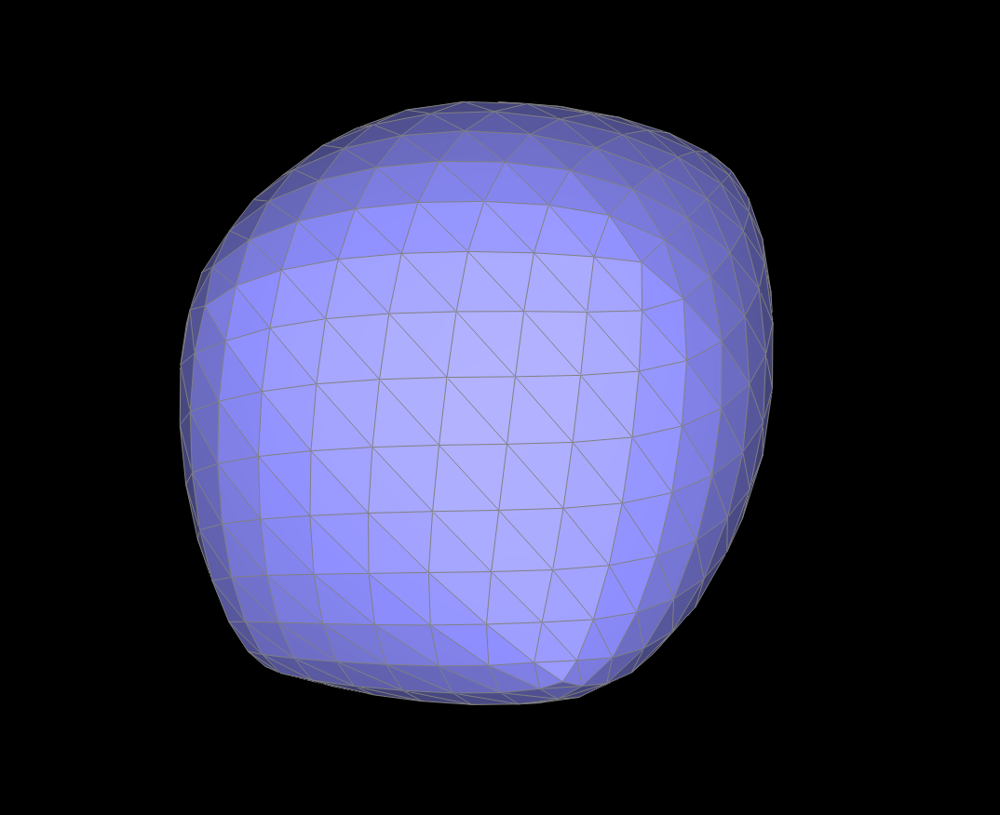
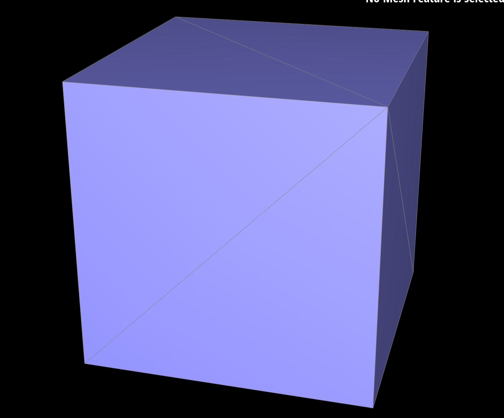
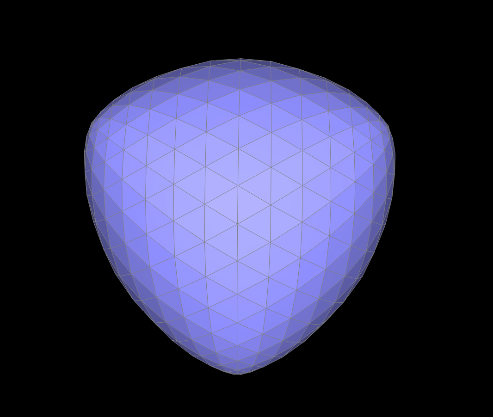
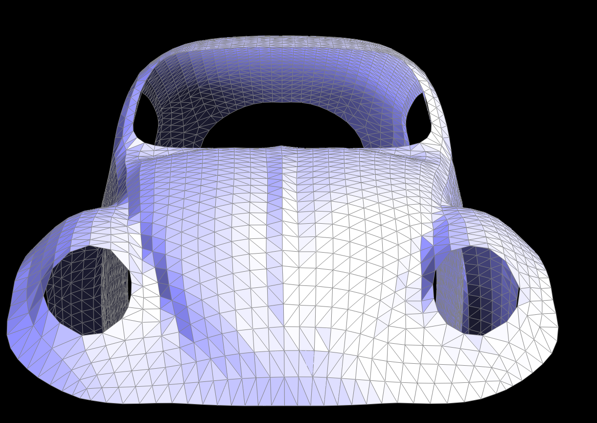
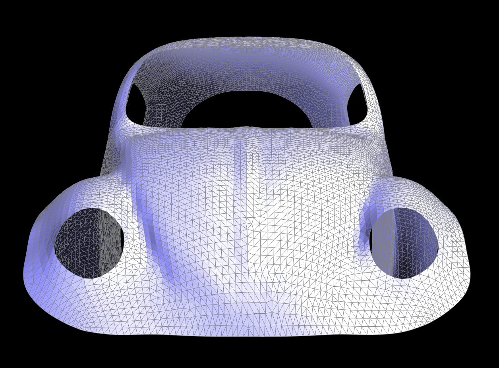

# Part 6: Loop Subdivision for Mesh Upsampling

## Implementation

I implemented Loop subdivision in 5 steps:

1. **Update original vertex positions** using weighted averages based on vertex degree
2. **Compute edge midpoint positions** using 3/8 and 1/8 weights for interior edges
3. **Split all original edges** and mark new edges appropriately
4. **Flip new interior edges** that connect one new and one old vertex
5. **Update final positions** by copying `newPosition` to `position`

## Key Tricks

### Boundary Handling

```cpp
// Interior vertices: standard Loop weights
v->newPosition = (1.0 - n * u) * v->position + u * neighbor_sum;

// Boundary vertices: 3/4 + 1/8 weights
v->newPosition = 0.75 * v->position + 0.125 * (b1 + b2);
```

### Safe Edge Collection

```cpp
std::vector<EdgeIter> originalEdges;
for (EdgeIter e = mesh.edgesBegin(); e != mesh.edgesEnd(); e++) {
    if (!e->isNew) originalEdges.push_back(e);
}
```

## Observations

### Sharp Features

Loop subdivision naturally smooths sharp corners and edges. Pre-splitting can help preserve features.




### Cube Asymmetry

The cube becomes asymmetric due to irregular connectivity. Pre-processing with edge flips creates uniform vertex degrees for symmetric results.






## Extra Credit: Boundary Support

I implemented boundary support with:

- Special weighting for boundary vertices (3/4 + 1/8)
- Simple averaging for boundary edge midpoints
- Proper boundary edge handling in edge split



