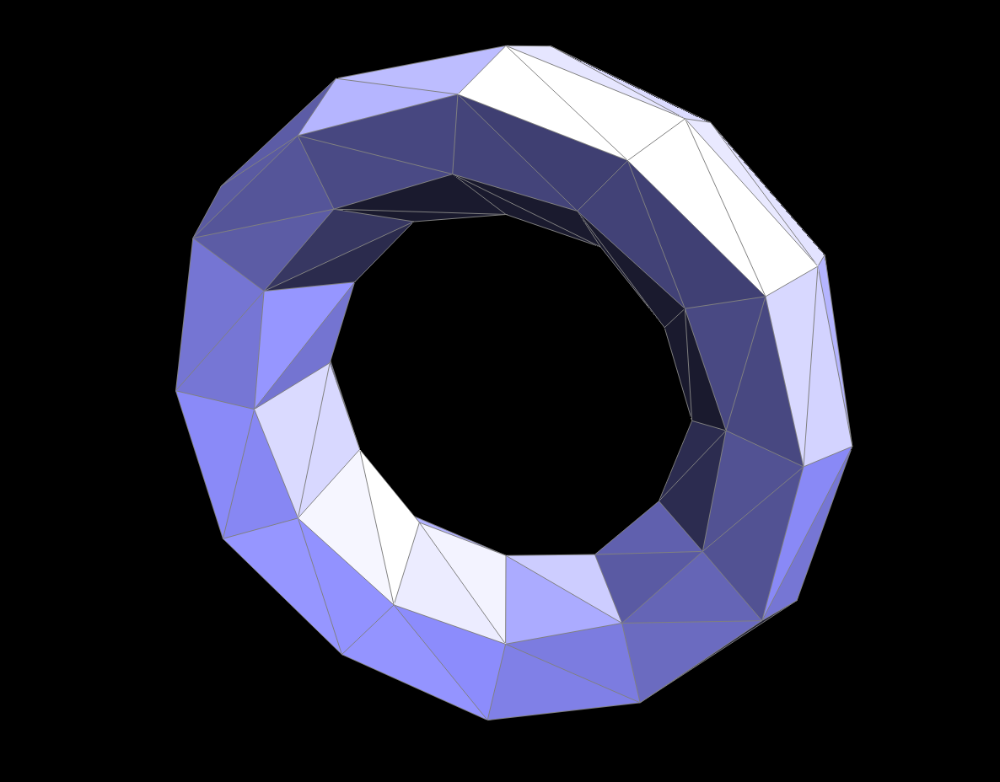
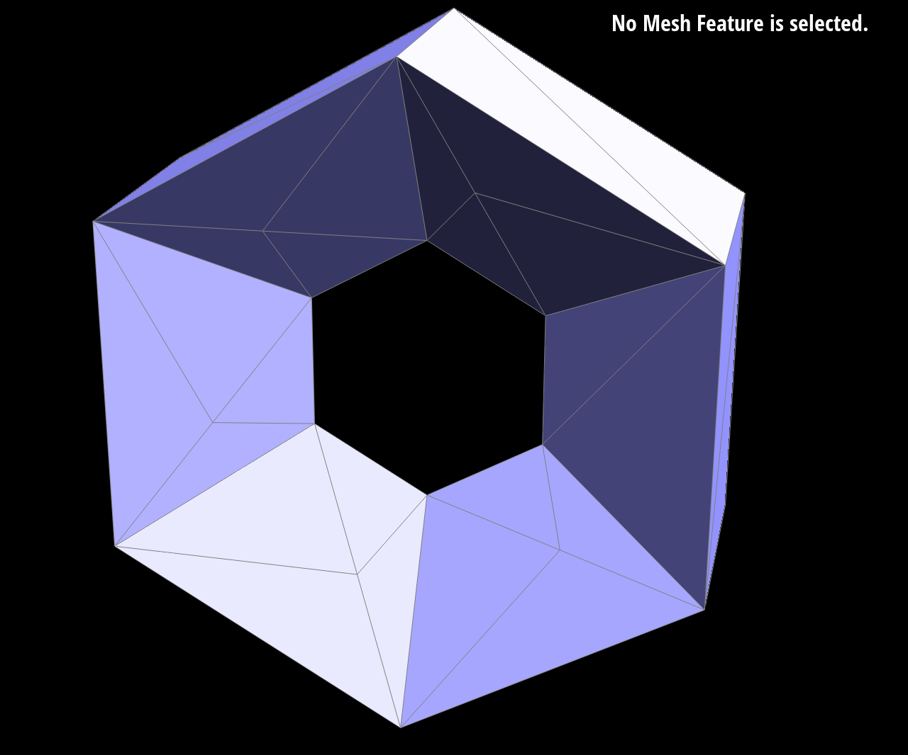
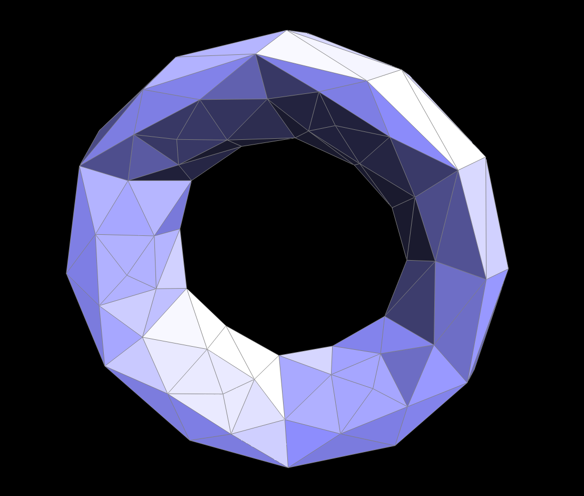

# Part 6: Loop Subdivision for Mesh Upsampling

## Implementation

I implemented Loop subdivision in 5 steps:

1. **Update original vertex positions** using weighted averages based on vertex degree
2. **Compute edge midpoint positions** using 3/8 and 1/8 weights for interior edges
3. **Split all original edges** and mark new edges appropriately
4. **Flip new interior edges** that connect one new and one old vertex
5. **Update final positions** by copying `newPosition` to `position`

## Key Tricks

### Boundary Handling

```cpp
// Interior vertices: standard Loop weights
v->newPosition = (1.0 - n * u) * v->position + u * neighbor_sum;

// Boundary vertices: 3/4 + 1/8 weights
v->newPosition = 0.75 * v->position + 0.125 * (b1 + b2);
```

### Safe Edge Collection

```cpp
std::vector<EdgeIter> originalEdges;
for (EdgeIter e = mesh.edgesBegin(); e != mesh.edgesEnd(); e++) {
    if (!e->isNew) originalEdges.push_back(e);
}
```

## Observations

### Sharp Features

Loop subdivision naturally smooths sharp corners and edges. Pre-splitting creates more uniform subdivision, resulting in smoother but more consistent results.

#### Before Subdivision


#### After Subdivision



#### Pre-splitting



#### After Pre-splitting Subdivision



### Cube Asymmetry

The cube becomes asymmetric due to irregular connectivity. Pre-processing with edge flips creates uniform vertex degrees for symmetric results.

#### Original Cube


#### Asymmetric Result


#### Pre-processed


#### Symmetric Result


**Explanation**

- The original cube mesh has inconsistent face diagonals, so opposite vertices have different valence (some faces share a vertex of degree 3, others 5). After subdivision these uneven weights push vertices outward unevenly, producing an asymmetric shape.
- Pre-processing each face by **flipping** edges so that every face diagonal is oriented the same way (all face diagonals meet at the same corner, forming a global “X” pattern) restores rotational symmetry of the connectivity.
- Optionally **splitting** the long body diagonals balances vertex degrees further.
- With this symmetric, regular connectivity the Loop weights are applied uniformly, so the cube remains symmetric after repeated subdivisions.

## Extra Credit: Boundary Support

I implemented boundary support with:

- Special weighting for boundary vertices (3/4 + 1/8)
- Simple averaging for boundary edge midpoints
- Proper boundary edge handling in edge split

#### Boundary Before


#### Boundary After


