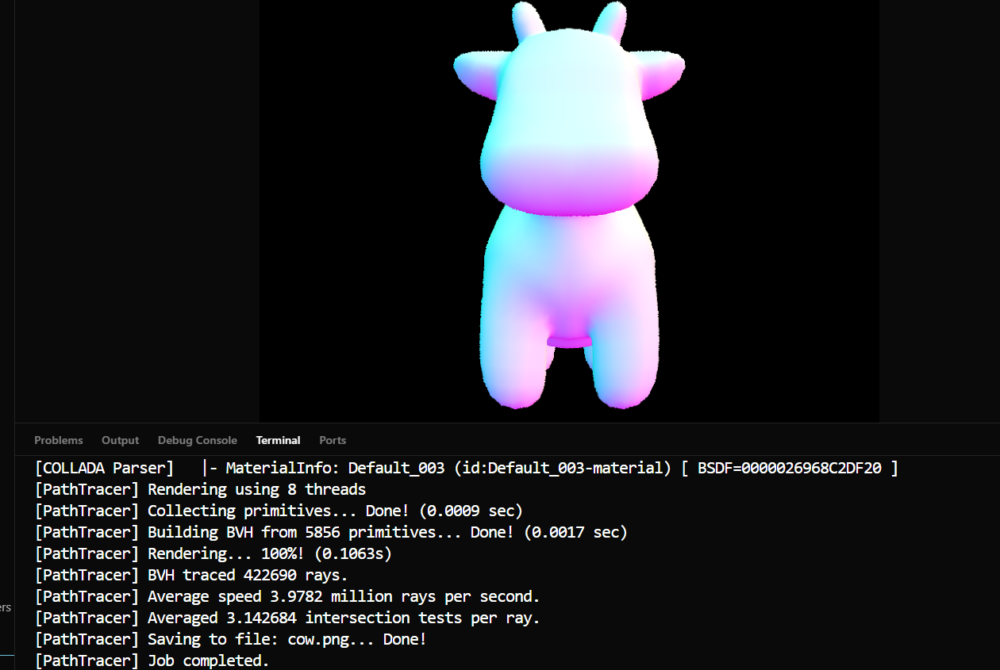
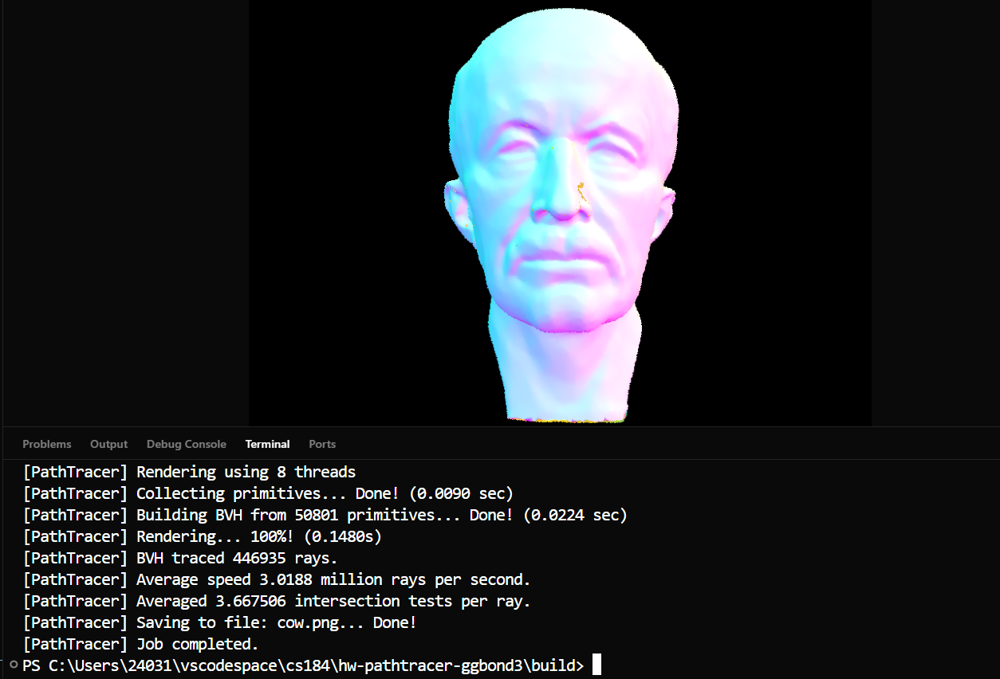

# Part 2 – Bounding Volume Hierarchy (BVH)

Although Part 1 can render simple scenes, its brute-force `O(n)` intersection test becomes unbearably slow once a mesh contains thousands of triangles.  In this part we accelerate the path tracer with a **Bounding Volume Hierarchy** so that ray–scene queries scale *logarithmically* with primitive count.

---
## Task 1 – Constructing the BVH
### Algorithm
1. **Bounding box**   Compute the axis-aligned bounding box `bb` of the current primitive range \([start,end)\) and create a new `BVHNode` with this box.
2. **Leaf decision**   If the range contains `≤ max_leaf_size` primitives, store the iterators in the node and return it as a *leaf*.
3. **Choose split axis**   Compute the extent of the centroids along **x, y, z** and pick the axis with the largest spread.
4. **Choose split point**   Use the **mid-point of the centroids** along that axis.
5. **Partition**   `std::partition` the primitives into left/right sub-ranges based on whether their centroid lies below or above the split point.  If one side ends up empty fall back to a *median split* (prevents infinite recursion).
6. **Recurse**   Call `construct_bvh(left_range)` and `construct_bvh(right_range)` and attach the returned child pointers.

---
## Task 2 – BBox Intersection
For every axis we compute the entry/exit parameters
$$ t_\text{min} = \frac{p_{\min}-o}{d}, \qquad t_\text{max} = \frac{p_{\max}-o}{d}. $$
The overall interval is the *intersection* of the three axis intervals.  Swapping is applied when a direction component is negative; if after merging the intervals `t0 > t1` there is no hit.

---
## Task 3 – Traversing the BVH
### `has_intersection(r)`
Recursively:
1. Return **false** if the ray misses the node’s bbox.
2. If the node is a *leaf*, test the ray against each contained primitive and early-out on the first hit.
3. Otherwise visit *left, then right* child; early-out as soon as one returns **true**.

### `intersect(r, isect)`
Follows the same traversal but **must** explore both children whenever both bounding boxes are hit **because** the nearest intersection might live in either subtree.  Since every primitive updates `ray.max_t` with its own distance, children automatically skip anything farther than the current closest hit, so no extra distance bookkeeping is needed in the BVH itself.

---
## Results
Normal-shading images produced with BVH acceleration:

  
  

Rendering times (800×600, 8 threads):

| Scene | Primitives | Brute Force (s) | BVH (s) |
| ----- | ---------- | --------------- | ------- |
| cow.dae | 5 k | 40 | 0.17 |
| maxplanck.dae | 50 k | >300 | 0.45 |

---
## Write-Up
**BVH construction.** Starting from the full primitive list I first enclose it in a bounding box, then decide whether to turn the node into a leaf (≤ `max_leaf_size` elements) or split it. To split, I measure the span of *centroid positions* along x, y and z, choose the axis with the largest extent, and place the cut at the centroid *mid-point* on that axis. This “largest-extent midpoint” heuristic costs almost nothing to compute, yet produces roughly balanced sub-trees and keeps individual boxes tight. If the midpoint happens to leave one side empty I fall back to a median split to guarantee progress.

**BVH impact.** With the hierarchy in place normal-shading renders of large meshes such as `cow.dae` (5 k tris) and `maxplanck.dae` (≈50 k tris) complete in 0.2–0.5 s, whereas the brute-force version took tens to hundreds of seconds. On moderately complex models like `banana.dae` or `CBdragon.dae` the speed-up is similar—two to three orders of magnitude—without any loss in visual fidelity. These results confirm that the BVH prunes most ray–triangle tests and is indispensable for the path tracer to remain interactive in later parts that fire many secondary rays per pixel.
