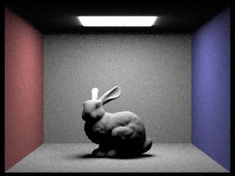
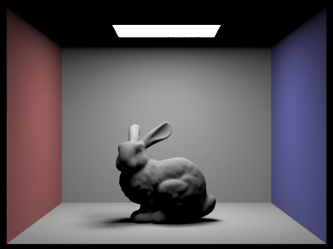
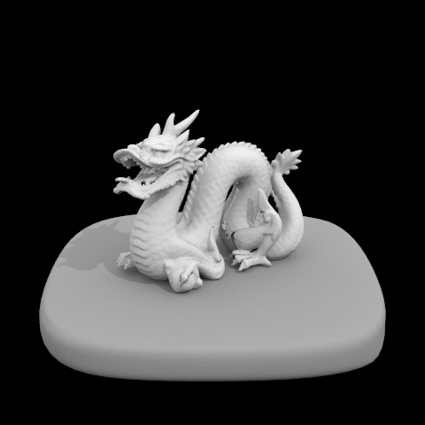
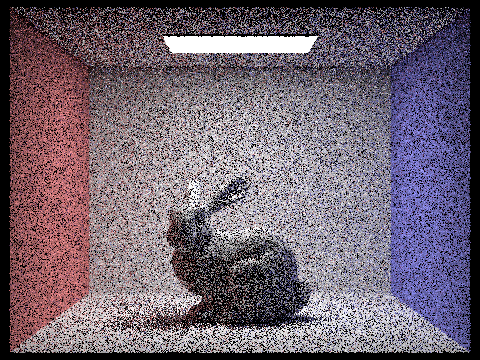
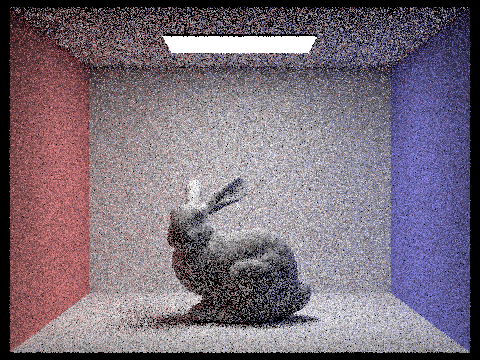
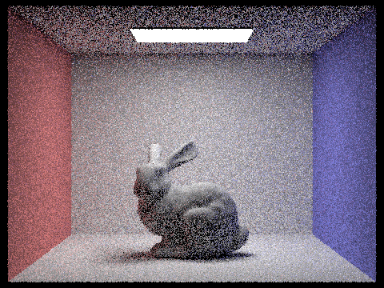
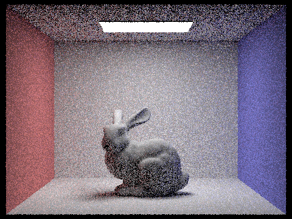

# Part 3

## Description

This is Part 3 of HW3.

## Implementation

1. **Uniform-hemisphere lighting (`estimate_direct_lighting_hemisphere`)** – builds an orthonormal frame from the shading normal, draws `num_samples` directions with `hemisphereSampler`, casts shadow rays (min_t = EPS_F) up to the first occluder, and accumulates `f(wo, wi) * L_e * \cos\theta / (pdf * num_samples)`.
2. **Importance-sampled lighting (`estimate_direct_lighting_importance`)** – iterates over all scene lights, draws `n = (light->is_delta() ? 1 : samples_per_light)` samples via `sample_L`, casts shadow rays limited to `distToLight - EPS_F`, and accumulates the same BSDF-weighted contribution divided by the light-provided pdf.

## Uniform-hemisphere lighting 
 

## Importance-sampled lighting 

## 4 different light rays

## Analyze
**Comparison of sampling strategies.** On the bunny renders above, uniform-hemisphere sampling wastes most rays on directions that never reach the ceiling light; the result is heavy speckle—particularly in penumbrae—even after 64 light samples.  Importance sampling, by directing every ray toward the emitter, achieves comparable smoothness with just 4 samples and is essentially converged by 16, producing crisp soft-shadow gradients and a cleaner image overall.  Empirically this corresponds to roughly an order-of-magnitude faster convergence, delivering the same visual quality in a fraction of the render time.  Also,visually, as the light rays increase in number, the noise points tends to decrease.