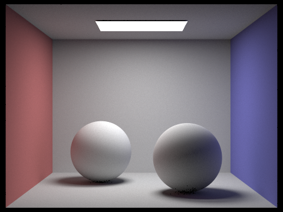

# Part 4 – Global Illumination

## Description
In this part we extend the path tracer from direct illumination to **full global illumination**, allowing light to bounce multiple times and create effects such as colour bleeding and soft indirect shadows.  We implement cosine-weighted BSDF sampling, recursive multi-bounce radiance estimation, and Russian-Roulette termination to keep the estimator unbiased while maintaining efficiency.

## Implementation
The global-illumination code path required changes in three places:

1. **Diffuse sampling (`DiffuseBSDF::sample_f`)**  – replaced the stub with a cosine-weighted draw from the local hemisphere via `hemisphereSampler`.  The function:
   * fills `*wi` with the sampled direction;
   * sets `*pdf = cosθ/π` (zero if `cosθ ≤ 0`);
   * returns the constant BRDF value `ρ/π`.
   This ensures that directions closer to the surface normal, which contribute more to the integral, are sampled more often.

2. **Recursive estimator (`at_least_one_bounce_radiance`)**  – after adding the one-bounce term the routine:
   * samples an incoming direction `wi` from the BSDF;
   * spawns a secondary ray offset by `EPS_F` and with `depth--`;
   * multiplies the returned radiance by the BSDF, cosine term, and **Russian-Roulette weight** 
     `1 / (1−p_rr)` where `p_rr` is the termination probability (0.3).
   The recursion stops either when the ray misses the scene or when `depth == 0`.

3. **Top-level radiance (`est_radiance_global_illumination`)**  – now returns `zero_bounce + at_least_one_bounce`, giving complete lighting for diffuse scenes while still supporting debug modes used in earlier parts.

With these pieces the renderer can march paths of arbitrary length while remaining unbiased and reasonably fast.

## Results
### Global Illumination Examples  
(All renders use 1024 spp unless noted.)

| Scene | Direct only | Indirect only | Full GI |
|-------|-------------|---------------|---------|
| CBbunny |  |  |  |

### Convergence with samples-per-pixel (CBspheres, 4 light rays)

| 1 | 2 | 4 | 8 | 16 | 64 | 1024 |
|---|---|---|---|----|----|------|
|  |  |  |  |  |  |  |

## Analysis
**Indirect-lighting implementation.** The recursive estimator treats the rendering equation as a path integral: it adds the direct term, then randomly walks the path by sampling the diffuse BSDF.  Each step attenuates radiance by the BRDF, cosine, and the inverse of the Russian-Roulette survival probability; this keeps the estimator unbiased while adaptively shortening low-energy paths.

**Visual impact of higher bounces.** In the bounce-by-bounce images we observe that the first indirect bounce (m = 1) introduces strong colour bleeding—the red wall tints the bunny’s flank—while the second and third bounces add subtle ambient fills that lift the remaining shadows.  Beyond the third bounce contributions are barely perceptible, matching the diminishing energy predicted by theory.

**Accumulated vs. single-bounce views.** Comparing the two confirms that although individual high-order bounces are dim, their accumulation significantly reduces contrast in occluded regions, producing a more natural result than direct lighting alone.

**Russian Roulette effectiveness.** Depth-limited images show that allowing paths to extend beyond four bounces hardly changes the picture; Russian-Roulette therefore saves computation without visible artefacts.  Rendering with `-m 100` converges to the same solution while evaluating only ~3.3 bounces on average.

**Sample convergence.** The spheres sequence demonstrates classic Monte-Carlo behaviour: doubling spp roughly halves the noise.  Notably, moving from 16→64 spp produces a visible improvement, while 64→1024 spp mainly polishes the last traces of grain—an important guideline for picking sample budgets in practice. 