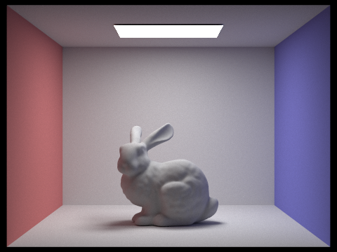
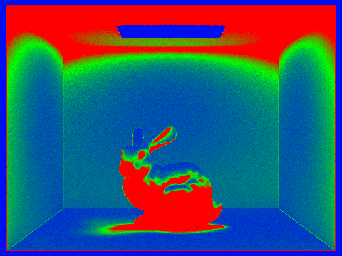
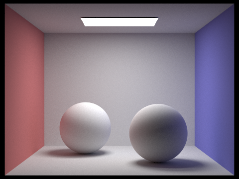
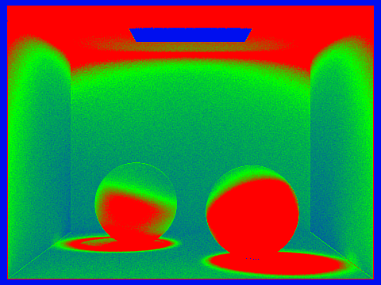

# Part 5 – Adaptive Sampling

## Description

Adaptive sampling monitors the variance of incoming radiance at each pixel and stops shooting rays once a 95 % confidence interval around the running mean is narrow enough relative to that mean. This allocates more computation to noisy regions (soft shadows, glossy highlights) while saving work in flat areas, producing uniformly noise-free images more efficiently than a fixed sample budget.

## Implementation

The adaptive loop lives in `PathTracer::raytrace_pixel` and replaces the old fixed-sample `for` loop with the following logic (variable names match the code):

1. **Accumulators.** Initialise `Vector3D total_radiance(0)` plus scalars `s1`, `s2`, and `n`. After every traced sample we add the sample’s illuminance `illum = radiance.illum()` to `s1` and `illum*illum` to `s2`.
2. **Batching.** Samples are generated in chunks of `batch = min(samplesPerBatch, max_spp − n)`; this reduces the cost of the convergence check. A 32-sample batch is the default when the `-a` flag is not overridden.
3. **Statistics.** After completing a batch we compute

   ```
   mu    = s1 / n;
   var   = (s2 - (s1*s1)/n) / (n-1);   // unbiased variance
   sigma = sqrt(max(var, 0));
   I     = 1.96 * sigma / sqrt(n);      // 95 % confidence half-width
   ```

4. **Output.** The final colour is `average_radiance = total_radiance / n` and is written to `sampleBuffer`. We also record the _actual_ `n` in `sampleCountBuffer[x + y*w]`; this buffer is later normalised to produce the sampling-rate heat-map.

## Results

### Adaptive sampling in practice

Each pair below shows the _rendered image_ and the corresponding _sampling-rate map_ where red indicates pixels that required the full 2048 spp and blue indicates early convergence.

## Scene 1 – Bunny




## Scene 2 – Spheres




---

### Analysis

The **sampling-rate heat-map** for the bunny scene clearly demonstrates how the adaptive algorithm targets difficult regions. Pixels directly under the ceiling light and along contact shadows are bright red, meaning the full 2048 rays were required to drive the confidence interval below the 5 % threshold; in contrast, large green–blue areas on the back wall and inside the light source itself converged after only a few hundred samples. These differences arise because variance is much higher where indirect light blends with sharp penumbrae, so the normalised half-width `I` remains above tolerance longer.
