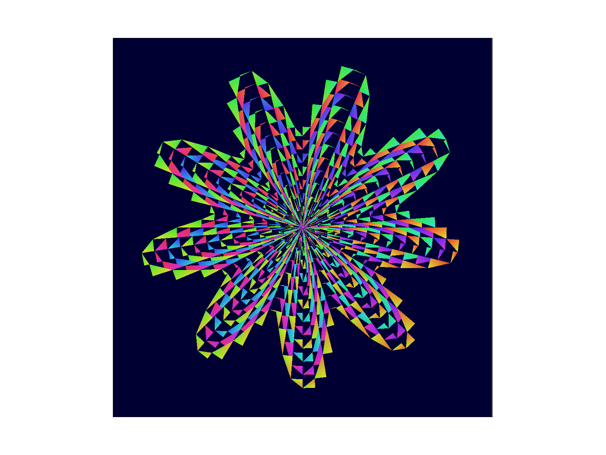

# Extra Credit: Creative SVG Generator

## Overview

For the extra credit, I designed and implemented a C++ program that generates creative SVG patterns, fully compatible with the CS184 rasterizer. The generator produces three distinct artistic patterns, with a special focus on a novel spiral-wave fusion design.

## Implementation

The generator is implemented in C++ (see `src/svg_generator.cpp`) and outputs SVG files using only the supported elements (`<colortri>`, `<rect>`). The program uses:

- **Polar coordinates** for spiral and wave paths
- **Trigonometric functions** for wave perturbation and multi-arm distribution
- **HSV color space** for smooth, vibrant color transitions

### Patterns Generated

1. **Rainbow Spiral** (`rainbow_spiral.svg`):

   - A colorful spiral pattern using interpolated color triangles
   - Rich color transitions radiating from the center

2. **Wave Pattern** (`wave_pattern.svg`):

   - Multiple sine wave patterns using interpolated color triangles
   - Organic, flowing look with smooth color gradients

3. **Spiral Wave Pattern** (`spiral_wave_pattern.svg`) - **Competition Entry**:
   - A creative fusion of spiral and wave aesthetics
   - Multi-arm spiral, each arm is a wavy path, with color varying by angle and radius
   - Strong sense of motion and visual impact

## How to Run

To generate the SVG files:

```bash
cd build
cmake .. -G Ninja
ninja svg_generator
./svg_generator
```

SVG files will be generated in the `../docs/` directory.

## Results

- `rainbow_spiral.svg` - Rainbow spiral
- `wave_pattern.svg` - Wave pattern
- `spiral_wave_pattern.svg` - Spiral-wave fusion (main competition entry)
- `competition.svg` - Same as spiral_wave_pattern.svg

<figure style="text-align:center;">
  
  <figcaption><em>Competition Entry</em></figcaption>
</figure>

All SVGs are 800x800 resolution and use only `<colortri>` and `<rect>`, ensuring full compatibility with the CS184 rasterizer.

## Creative Explanation

**Spiral Wave Pattern** is a fusion of spiral and wave aesthetics:

- Each arm is a spiral path with a sine wave perturbation on the radius
- Multiple arms, with color varying by arm and angle
- Combines the order of spirals with the motion of waves

This design leverages mathematical beauty and color theory to create a visually striking, dynamic pattern that stands out among procedural SVG art.

## Customization

- You can adjust the number of spiral arms, wave frequency, amplitude, and other parameters in the code for different styles
- The HSV color mapping can be modified to explore more artistic effects

## Notes

- All SVGs are 800x800 resolution
- `competition.svg` is identical to `spiral_wave_pattern.svg`
- Only uses `<colortri>` and `<rect>`, fully compatible with the CS184 rasterizer
