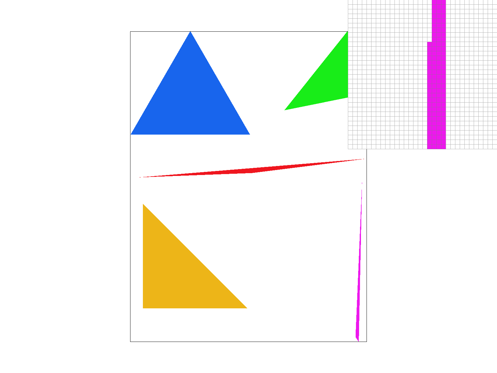

# Task 1: Drawing Single-Color Triangles

## Overview

This task implements the `rasterize_triangle` function in `rasterizer.cpp` to draw single-color triangles using point-in-triangle tests with sample points at pixel centers. The implementation must handle triangles regardless of winding order and efficiently rasterize within the triangle's bounding box.

## Implementation Details

### Approach

My triangle rasterization approach uses edge function tests with optimized incremental stepping. The algorithm first ensures the triangle is wound counter-clockwise by checking the signed area and swapping vertices if necessary. Then it calculates the bounding box and uses edge functions to determine if each sample point lies inside the triangle. The key optimization is using incremental edge function evaluation, where edge values are updated by simple additions rather than recalculating from scratch for each sample.

### Key Algorithms

- **Point-in-Triangle Test**: Using Three Line Tests
- **Bounding Box Optimization**: Sampling only within the triangle's bounding box (further optimization is done by line-scanning)
- **Pixel Center Sampling**: Sample point at (x+0.5, y+0.5) for each pixel

### Code Structure

`rasterize_triangle` function in `rasterizer.cpp`

## Results

### Output Images

<figure>
  
  <figcaption><em>Figure 1: test4.svg with the default viewing parameters and with the pixel inspector centered on an interesting part of the scene</em></figcaption>
</figure>

### Analysis

The triangle rasterization produces clean, accurate results with proper edge handling. The edge function approach ensures that samples exactly on triangle edges are handled consistently using the primary edge rule. The incremental edge stepping optimization significantly improves performance compared to naive implementations.

## Algorithm Efficiency

My algorithm is no worse than one that checks each sample within the bounding box because it uses the same bounding box calculation and only samples within that region. However, it's significantly more efficient due to several optimizations:

1. **Incremental Edge Function Evaluation**: Instead of recalculating edge functions for each sample, I pre-compute the edge function increments and update values by simple addition.
2. **Early Exit Optimization**: When processing a scanline, if we exit the triangle, we can break early since remaining samples in that row will also be outside.

The bounding box of the triangle is defined as the smallest rectangle that can be drawn whilst ensuring that the entire triangle is within it.

## Challenges and Solutions

### Challenges Faced

- **Winding Order**: Triangles can be defined in clockwise or counter-clockwise order
- **Edge Cases**: Handling samples exactly on triangle edges
- **Efficiency**: Avoiding checking every pixel in the framebuffer

### Solutions Implemented

- **Winding Order Independence**: I handle different winding orders by computing the signed area of the triangle using the cross product. If the area is negative (clockwise winding), I swap vertices 1 and 2 to ensure counter-clockwise winding. This ensures consistent edge function evaluation.
- **Edge Handling**: I use the primary edge rule (OpenGL/Direct3D Edge Rules) to handle samples exactly on triangle edges. A primary edge is defined as either a left edge (dy > 0) or a top edge (dy == 0 && dx < 0). Samples on primary edges are considered inside the triangle.
- **Bounding Box Optimization**: I calculate the bounding box using floor/ceil operations on the minimum and maximum coordinates, then clamp to framebuffer bounds. This ensures we only process pixels that could potentially contain triangle samples.

## Performance Considerations

### Basic Implementation

The basic implementation (`rasterize_triangle_basic`) uses a simple double-nested loop over the bounding box, calculating edge functions for each pixel center. This approach is straightforward but inefficient for large triangles as it recalculates edge functions for every sample.

### Extra Credit Optimizations

I implemented several advanced optimizations in the main `rasterize_triangle` function:

1. **Incremental Edge Function Evaluation**: Pre-compute edge function increments and update values by addition
2. **Scanline Optimization**: Process samples row by row with early exit when leaving the triangle
3. **Primary Edge Handling**: Precise handling of samples on triangle edges

**Note**: To run the performance benchmark, build the project and execute `./rasterize_triangle_bench` in the build directory.

| Implementation | Time (ms)  | Optimization Details                                            |
| -------------- | ---------- | --------------------------------------------------------------- |
| Basic          | 4470.82 ms | Standard bounding box approach with recalculated edge functions |
| Optimized      | 2214.15 ms | Incremental edge stepping, scanline optimization, early exit    |
| Speed-up       | 2.02x      | Significant performance improvement through optimizations       |

## Testing

The implementation successfully renders the following test files:

- `basic/test3.svg`
- `basic/test4.svg`
- `basic/test5.svg`
- `basic/test6.svg` (tests winding order independence)
