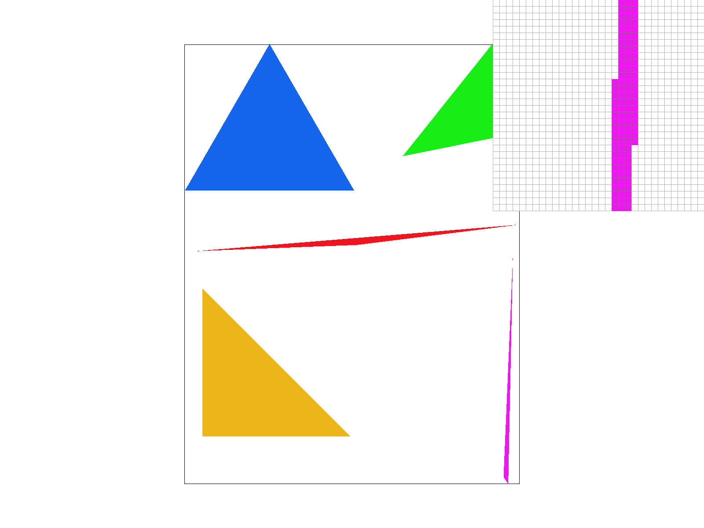
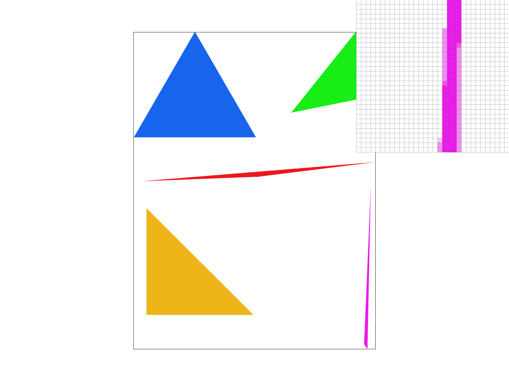
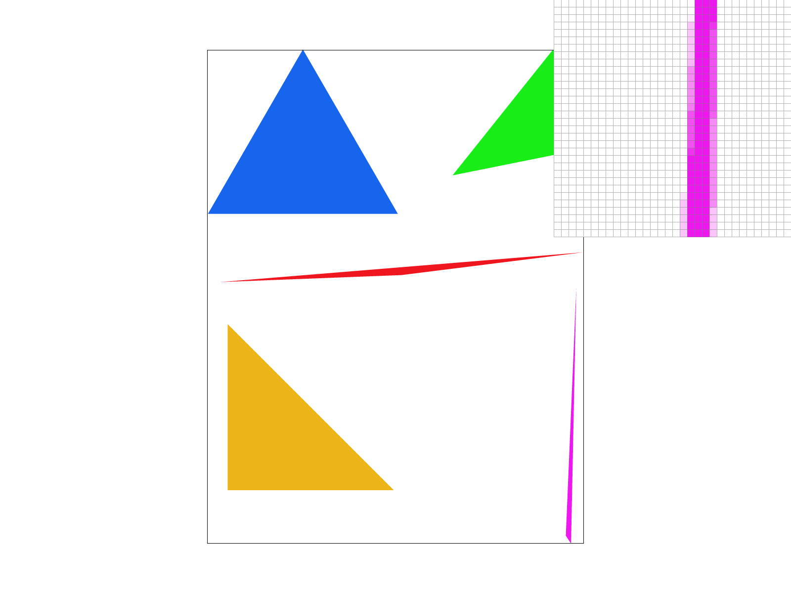

# Task 2: Antialiasing by Supersampling

## Overview

This task implements supersampling antialiasing for triangles by sampling multiple times per pixel and averaging the results. The implementation uses a higher-resolution sample buffer and then downsamples to the final framebuffer resolution, significantly reducing aliasing artifacts on triangle edges.

## Implementation Details

### Approach

The supersampling algorithm works by treating each pixel as a grid of sub-samples and rasterizing triangles at this higher resolution. For a sample rate of N, we create a √N × √N grid of samples per pixel. The triangle rasterization is performed at this sub-pixel level, and then the results are averaged down to produce the final pixel color.

**Why supersampling is useful:**

- Reduces aliasing artifacts by capturing more detail at triangle edges
- Provides smoother transitions between covered and uncovered areas
- Improves visual quality especially for thin triangles and diagonal edges

### Key Algorithms

- **Grid Supersampling**: Sample at sqrt(sample_rate) × sqrt(sample_rate) grid locations per pixel
- **High-Resolution Rasterization**: Treat sample buffer as higher-resolution framebuffer
- **Downsampling**: Average supersamples to produce final pixel colors
- **Memory Management**: Dynamic buffer sizing based on framebuffer dimensions and sample rate

### Code Structure

- `rasterize_triangle` function in `rasterizer.cpp`
- `resolve_to_framebuffer` function in `rasterizer.cpp`
- `set_sample_rate` function in `rasterizer.cpp`

## Results

### Output Images

The following images show the effect of supersampling on test4.svg, which contains thin triangles that clearly demonstrate the antialiasing improvements:

#### Sample Rate 1 (No Antialiasing)



_Without supersampling, triangle edges show clear stair-stepping artifacts, especially visible on thin triangle corners and diagonal edges._

#### Sample Rate 4 (2x2 Supersampling)



_With 2×2 supersampling, edges become noticeably smoother. The stair-stepping is reduced, and thin triangle corners show improved coverage._

#### Sample Rate 16 (4x4 Supersampling)



_With 4×4 supersampling, edges are very smooth with minimal aliasing artifacts. The visual quality is significantly improved, especially for thin geometric features._

### Analysis

**Visual Improvements:**

- **Edge Smoothness**: Higher sample rates produce progressively smoother triangle edges
- **Thin Feature Preservation**: Thin triangles and sharp corners are better preserved
- **Reduced Stair-stepping**: Diagonal edges show less obvious pixel-level artifacts

**Performance Trade-offs:**

- **Memory**: Sample rate 4 requires 4× memory, sample rate 16 requires 16× memory
- **Computation**: Higher sample rates require more edge function evaluations
- **Quality vs Speed**: Sample rate 4 provides good quality improvement with reasonable cost

**Technical Implementation Details:**

The supersampling algorithm uses several key optimizations:

1. **Incremental Edge Function Evaluation**: Instead of computing edge functions for each sub-sample independently, the algorithm uses incremental updates:

   ```cpp
   // Pre-computed edge function increments
   float step_x_e0 = -dy01 * inv_grid_size, step_y_e0 = dx01 * inv_grid_size;
   float step_x_e1 = -dy12 * inv_grid_size, step_y_e1 = dx12 * inv_grid_size;
   float step_x_e2 = -dy20 * inv_grid_size, step_y_e2 = dx20 * inv_grid_size;
   ```

2. **Primary Edge Handling**: Special handling for edges that are exactly on pixel boundaries:

   ```cpp
   bool inside = (d_e01 > 0 || (d_e01 == 0 && is_e01_p)) &&
                 (d_e12 > 0 || (d_e12 == 0 && is_e12_p)) &&
                 (d_e20 > 0 || (d_e20 == 0 && is_e20_p));
   ```

3. **Early Exit Optimization**: When a row exits the triangle, remaining sub-pixels are skipped:
   ```cpp
   if (inside) {
       sample_buffer[base_index + sample_idx] = color;
       in_segment = true;
   } else if (in_segment) {
       break; // Exited triangle for this supersampled row
   }
   ```

## Data Structures and Memory Management

### Sample Buffer Organization

The `sample_buffer` is organized as a 1D vector with the following layout:

```
sample_buffer[base_index + sample_idx]
```

where:

- `base_index = (y * width + x) * sample_rate` - starting index for pixel (x,y)
- `sample_idx = sub_y * grid_size + sub_x` - index within the pixel's sample grid

For example, with sample rate 4 (2×2 grid):

- `sample_idx = 0`: top-left sub-sample
- `sample_idx = 1`: top-right sub-sample
- `sample_idx = 2`: bottom-left sub-sample
- `sample_idx = 3`: bottom-right sub-sample

### Memory Requirements

- **Sample Rate 1**: 1 sample per pixel = `width × height × 3` bytes
- **Sample Rate 4**: 4 samples per pixel (2×2 grid) = `width × height × 12` bytes
- **Sample Rate 16**: 16 samples per pixel (4×4 grid) = `width × height × 48` bytes

### Buffer Management

The buffer is dynamically resized in two key functions:

1. **`set_sample_rate(unsigned int rate)`**: Resizes buffer when sample rate changes
2. **`set_framebuffer_target(...)`**: Resizes buffer when framebuffer dimensions change

Both functions preserve the current sample rate and initialize new samples to `Color::White`.

### Point and Line Rendering

For points and lines, which don't require supersampling, the `fill_pixel()` function ensures all sub-samples of a pixel are set to the same color:

```cpp
void RasterizerImp::fill_pixel(size_t x, size_t y, Color c) {
    size_t base_index = (y * width + x) * sample_rate;
    for (unsigned int s = 0; s < sample_rate; ++s) {
        sample_buffer[base_index + s] = c;
    }
}
```

## Performance Considerations

### Memory Overhead

The memory overhead scales linearly with sample rate:

- **Sample Rate 1**: Baseline memory usage
- **Sample Rate 4**: 4× memory usage, good quality improvement
- **Sample Rate 16**: 16× memory usage, excellent quality but high cost

### Computational Cost

The computational cost increases with sample rate due to:

- More edge function evaluations per pixel
- Larger bounding box traversal
- More sample buffer writes

However, the optimized incremental edge stepping algorithm minimizes the performance impact by reusing computed edge function increments.

<!-- ### Extra Credit: Alternative Sampling Patterns

The current implementation uses regular grid sampling. Alternative patterns could include:

- **Jittered Sampling**: Random offset within each sub-pixel for better noise distribution
- **Low-Discrepancy Sequences**: Quasi-random sampling patterns for better coverage
- **Adaptive Sampling**: Higher sampling density at edges, lower in flat areas

| Sampling Method    | Visual Quality | Performance | Memory Usage |
| ------------------ | -------------- | ----------- | ------------ |
| Grid Supersampling | Good           | Fast        | High         |
| Jittered Sampling  | Better         | Similar     | Same         |
| Adaptive Sampling  | Excellent      | Variable    | Variable     | -->

## Testing

The implementation successfully reduces aliasing artifacts on:

- Triangle edges
- Thin triangle corners
- Diagonal edges
- All test files from Task 1 with improved visual quality

The antialiasing effect is most dramatic on test4.svg due to its thin geometric features, but improvements are visible across all test cases.
