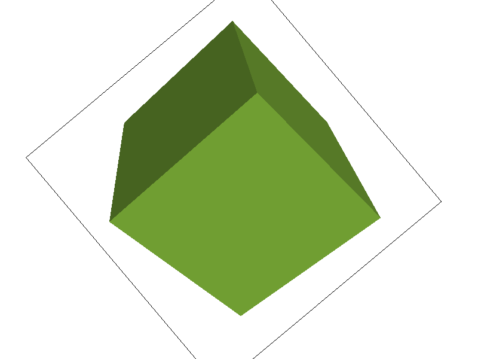

# Task 3: Transforms

## Overview

This task implements three fundamental geometric transformations (translate, scale, rotate) in homogeneous coordinates using 3×3 matrices. These transforms enable hierarchical transformations of SVG objects, allowing for complex animations and positioning of graphical elements.

## Implementation Details

### Approach

[To represent translation, scaling, and rotation uniformly, we embed each point 
(x,y) in homogeneous coordinates as (x,y,1). All three operations then become simple 3×3 matrix multiplications. By implementing those matrix calculations correctly, we naturally get the desired transformations.]

### Key Algorithms

- **Translation Matrix**: Move objects by specified x and y offsets
- **Scaling Matrix**: Scale objects by specified x and y factors
- **Rotation Matrix**: Rotate objects by specified angle around origin
- **Homogeneous Coordinates**: Using 3×3 matrices for 2D transformations


## Results

### Custom Robot Animation

[What I did is translate (50 -30) to both right and left outmost arm, and rotate them -90 degrees to make them "lift their hands" to show that they are strong. Also, I changed the color to yellow. ]


## Mathematical Foundation

#### Translation Matrix

```
[ 1  0  dx ]
[ 0  1  dy ]
[ 0  0   1 ]
```

#### Scaling Matrix

```
[ sx  0   0 ]
[  0  sy  0 ]
[  0  0   1 ]
```

#### Rotation Matrix

```
[ cos(θ)  -sin(θ)  0 ]
[ sin(θ)   cos(θ)  0 ]
[   0       0      1 ]
```

## Implementation Details

### Hierarchical Transforms

Example SVG structure:

```xml
<g transform="rotate(135)">
  <g transform="translate(10, 20)">
    <g transform="scale(2, 1)">
      <!-- polygon definitions -->
    </g>
  </g>
</g>
```

## Extra Credit: GUI Enhancement

[we added two more button "[" and "]" where each can rotate counter-clockwise 10° and rotate clockwise 10° . To implement that, we have added a new function called void DrawRend::rotate_view(float deg), in line 479 of drawrend.cpp, which can rotate the current view around its center by the specified angle (deg degrees)]


### Implementation Details

[The rotate_view method first finds the SVG-to-NDC matrix for the current document, then computes the SVG-space coordinates of the viewport center by applying the inverse transform to the NDC point (0.5, 0.5). It constructs a rotation matrix that translates this center to the origin, rotates by the given angle, and translates back. Finally, it post-multiplies the existing SVG→NDC matrix by this rotation, ensuring that subsequent SVG coordinates are rotated about the view center before being mapped into normalized device coordinates.]

### Example Image



## Testing

### Test Files

- `svg/transforms/robot.svg` - Basic transform testing
- `robot.svg` - Custom animation demonstration


