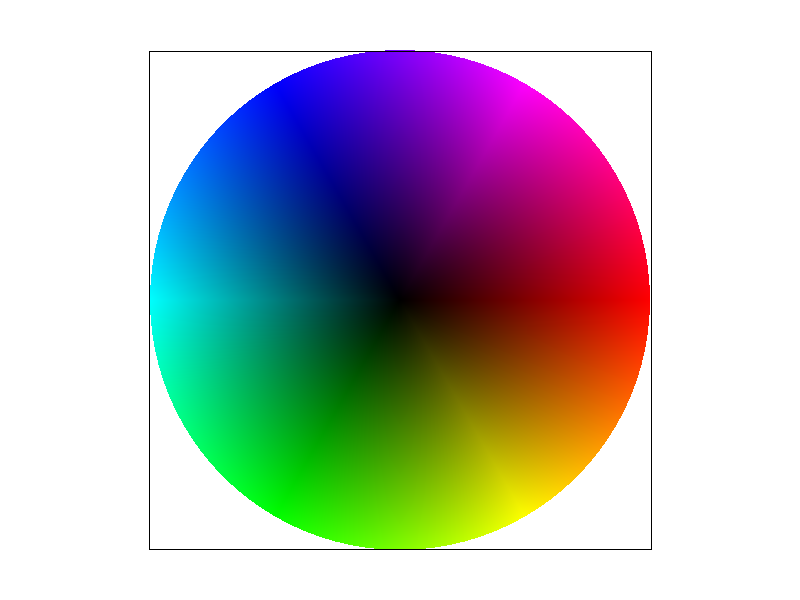

# Task 4: Barycentric Coordinates

## Overview

This task implements barycentric coordinate interpolation for triangles, allowing smooth color blending across triangle surfaces. The implementation enables rendering triangles with colors defined at vertices and interpolated across the entire triangle area, creating smooth gradients and color transitions.

## Implementation Details

### Approach

- **Barycentric Coordinate Calculation**: Computing (α, β, γ) coordinates for each pixel
- **Color Interpolation**: Linear interpolation of vertex colors using barycentric weights
- **Point-in-Triangle Test**: Using barycentric coordinates for inside/outside testing

Barycentric coordinates (α, β, γ) represent a point P inside a triangle as a weighted combination of the three vertices:

**P = αA + βB + γC**

where:

- α + β + γ = 1
- α, β, γ ≥ 0 (for points inside the triangle)

### Color Interpolation

The interpolated color at point P is:

**C(P) = αC(A) + βC(B) + γC(C)**

where C(A), C(B), C(C) are the colors at vertices A, B, and C respectively.
For example, given a triangle whose three vertices are colored red, blue, and green, the color at any point inside it is computed by taking a weighted average of those vertex colors—where the weights (the barycentric coordinates) reflect the point’s relative proximity to each of the three vertices.

## Results

### Test Files

- `svg/basic/test7.svg` - Color wheel demonstration

