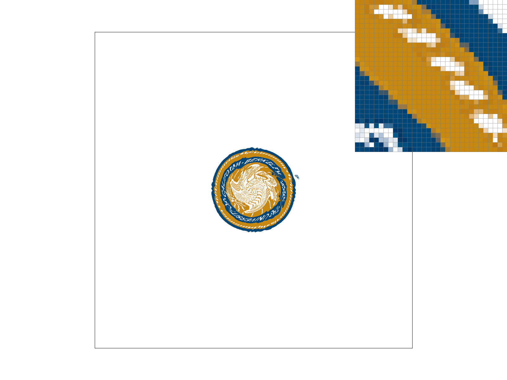
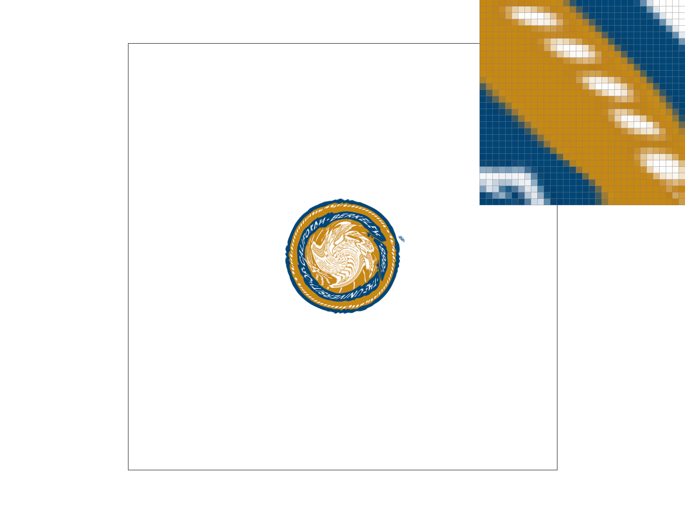

# Task 5: "Pixel sampling" for texture mapping

## Overview

This task implements texture mapping for triangles using two pixel sampling methods: nearest neighbor and bilinear interpolation. The implementation enables rendering triangles with colors sampled from texture images using 2D texture coordinates, providing realistic surface detail and patterns.

## Implementation Details

### Approach

[**TODO: Explain pixel sampling in your own words and describe how you implemented it to perform texture mapping. Briefly discuss the two different pixel sampling methods, nearest and bilinear.**]

### Key Algorithms

- **Nearest Neighbor Sampling**: Select the closest texel to the sample point
- **Bilinear Interpolation**: Weighted average of four nearest texels
- **Texture Coordinate Interpolation**: Using barycentric coordinates to interpolate UV coordinates
- **Mipmap Level 0**: Using full-resolution texture for sampling

### Code Structure

```cpp
// Key implementations in rasterizer.cpp and texture.cpp
void RasterizerImp::rasterize_textured_triangle(
    float x0, float y0, float u0, float v0,
    float x1, float y1, float u1, float v1,
    float x2, float y2, float u2, float v2,
    Texture& tex) {
    // TODO: Implement texture mapping
    // 1. Calculate barycentric coordinates for each pixel
    // 2. Interpolate texture coordinates (u,v) using barycentric weights
    // 3. Sample texture using current PixelSampleMethod
    // 4. Fill pixel with sampled color
}

Color Texture::sample_nearest(float u, float v, int level) {
    // TODO: Implement nearest neighbor sampling
    // 1. Convert (u,v) to texel coordinates
    // 2. Round to nearest integer coordinates
    // 3. Return color of nearest texel
}

Color Texture::sample_bilinear(float u, float v, int level) {
    // TODO: Implement bilinear interpolation
    // 1. Convert (u,v) to texel coordinates
    // 2. Find four nearest texels
    // 3. Interpolate between them using bilinear weights
    // 4. Return interpolated color
}
```

## Mathematical Foundation

### Texture Coordinate Interpolation

Texture coordinates (u,v) are interpolated using barycentric coordinates:

**u(P) = αu₀ + βu₁ + γu₂**
**v(P) = αv₀ + βv₁ + γv₂**

where (u₀,v₀), (u₁,v₁), (u₂,v₂) are texture coordinates at vertices.

### Nearest Neighbor Sampling

[**TODO: Explain the mathematical approach for nearest neighbor sampling**]

For texture coordinates (u,v), the nearest texel is at:

```
texel_x = round(u * texture_width)
texel_y = round(v * texture_height)
```

### Bilinear Interpolation

[**TODO: Explain the mathematical approach for bilinear interpolation**]

For texture coordinates (u,v), interpolate between four texels:

```
Color = (1-s)(1-t)C₀₀ + s(1-t)C₁₀ + (1-s)tC₀₁ + stC₁₁
```

where s and t are fractional parts of texel coordinates.

## Results

### Comparison Screenshots

[**TODO: Check out the svg files in the svg/texmap/ directory. Use the pixel inspector to find a good example of where bilinear sampling clearly defeats nearest sampling. Show and compare four png screenshots using nearest sampling at 1 sample per pixel, nearest sampling at 16 samples per pixel, bilinear sampling at 1 sample per pixel, and bilinear sampling at 16 samples per pixel.**]

#### Nearest Sampling - 1 Sample per Pixel



#### Nearest Sampling - 16 Samples per Pixel


#### Bilinear Sampling - 1 Sample per Pixel


#### Bilinear Sampling - 16 Samples per Pixel



### Analysis

[**TODO: Comment on the relative differences. Discuss when there will be a large difference between the two methods and why.**]

## Implementation Details

### Texture Coordinate Handling

[**TODO: Explain how you handle texture coordinate interpolation**]

### Sampling Method Selection

[**TODO: Explain how you switch between nearest and bilinear sampling**]

### Mipmap Integration

[**TODO: Explain how you work with the mipmap structure**]

## Challenges and Solutions

### Challenges Faced

- **Coordinate Conversion**: Converting between texture coordinates and texel indices
- **Boundary Handling**: Managing texture wrapping and edge cases
- **Sampling Quality**: Ensuring proper interpolation for bilinear sampling
- **Performance**: Efficient texture lookup and sampling

### Solutions Implemented

- **Coordinate Mapping**: [**TODO: Explain your texture coordinate to texel conversion**]
- **Boundary Conditions**: [**TODO: Explain how you handle texture boundaries**]
- **Interpolation Weights**: [**TODO: Explain your bilinear interpolation implementation**]
- **Mipmap Access**: [**TODO: Explain how you access the correct mipmap level**]

## Performance Considerations

### Sampling Method Comparison

| Method           | Quality | Performance | Memory Access |
| ---------------- | ------- | ----------- | ------------- |
| Nearest Neighbor | [TODO]  | [TODO]      | [TODO]        |
| Bilinear         | [TODO]  | [TODO]      | [TODO]        |

### Optimization Strategies

[**TODO: Discuss any optimizations in texture sampling**]

## Testing

### Test Files

- `svg/texmap/test1.svg` - Basic texture mapping
- `svg/texmap/test2.svg` - Texture coordinate testing
- `svg/texmap/test4.svg` - Complex texture patterns
- `svg/texmap/test5.svg` - Texture filtering demonstration
- `svg/texmap/test6.svg` - Advanced texture mapping

### Verification

[**TODO: Explain how you verified your texture mapping works correctly**]

## Comparison with Previous Tasks

### Integration with Task 4

[**TODO: Discuss how barycentric interpolation is used for texture coordinates**]

### Integration with Task 2

[**TODO: Discuss how supersampling affects texture sampling quality**]

## Texture Quality Analysis

### When Methods Differ Significantly

[**TODO: Explain scenarios where bilinear sampling shows clear advantages over nearest neighbor**]

### Visual Artifacts

[**TODO: Discuss common artifacts in each sampling method**]

## Conclusion

[**TODO: Summary of what was learned about texture mapping and pixel sampling**]

## Additional Examples

[**TODO: Include any additional texture mapping examples or interesting patterns**]

### Custom Texture Patterns

[**TODO: Show additional examples of texture mapping**]


