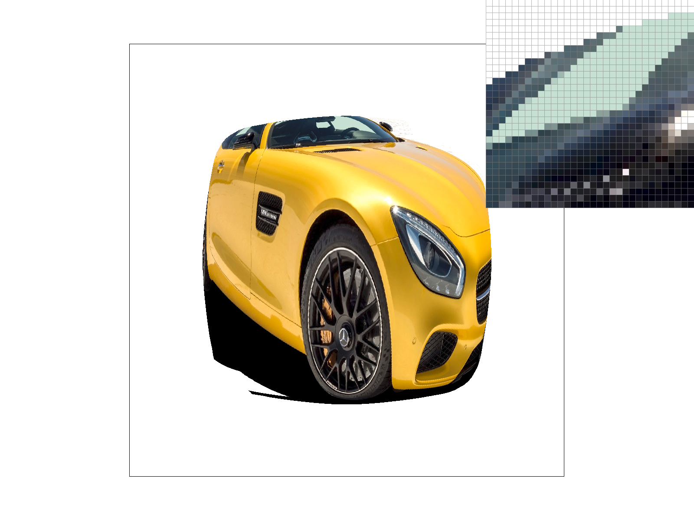
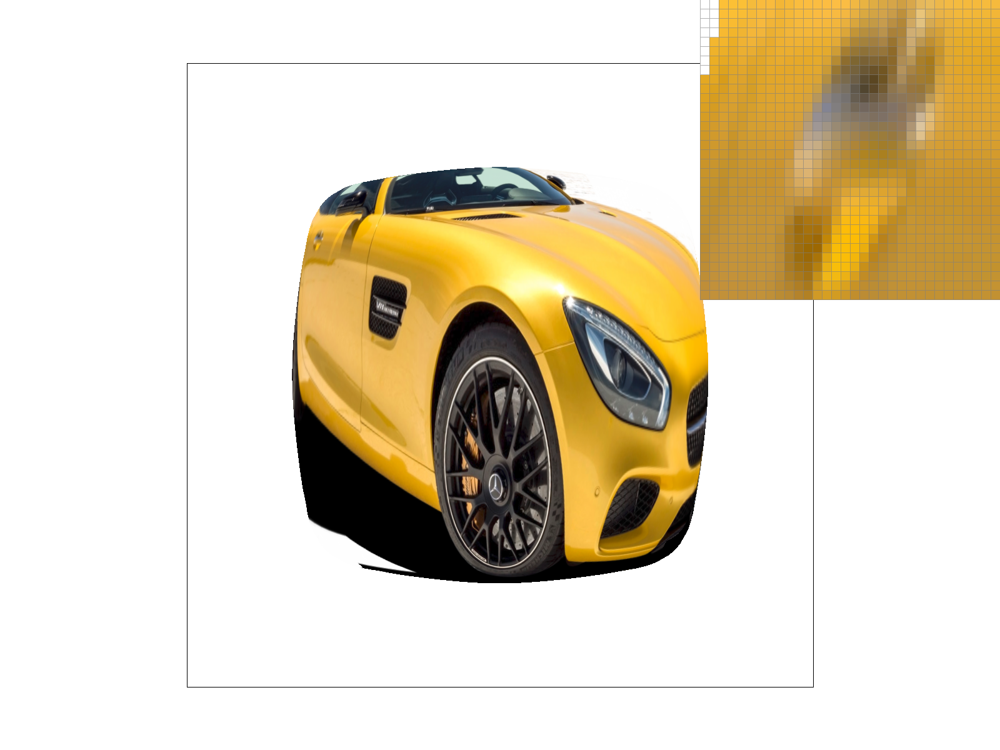
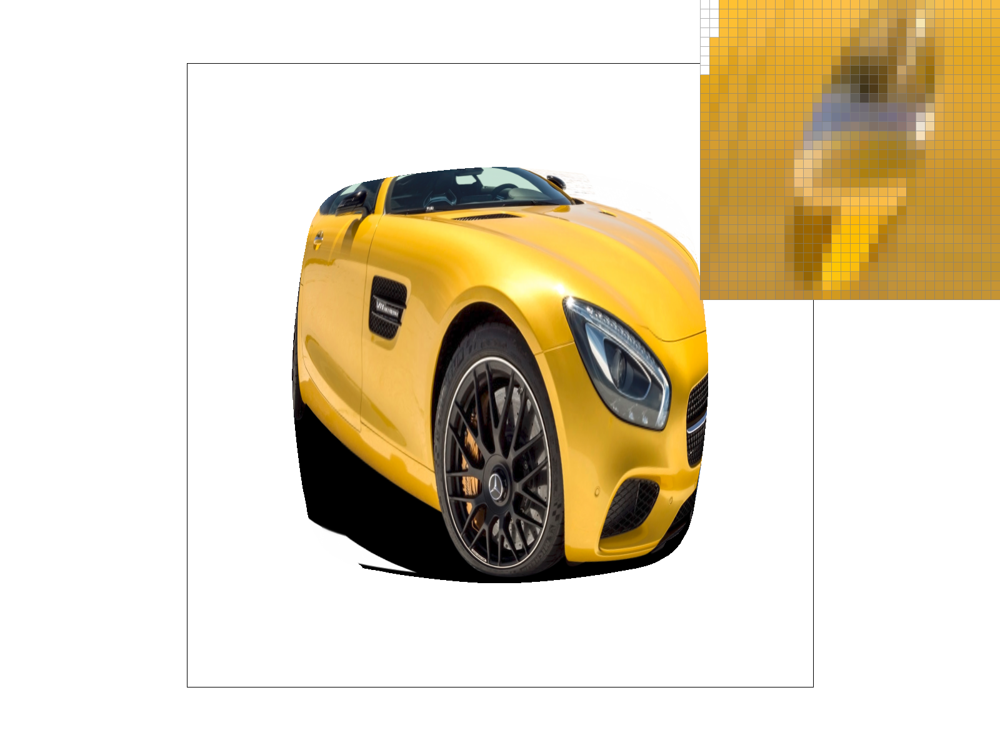

# Task 6: "Level sampling" with mipmaps for texture mapping

## Overview

This task implements mipmap level sampling for texture mapping, supporting three level sampling methods: zero-level, nearest level, and linear level interpolation. The implementation enables adaptive texture resolution based on screen-space derivatives, significantly improving rendering quality and performance for textured surfaces.

## Implementation Details

### Approach

Level sampling is a technique that adaptively selects the appropriate mipmap level based on how much the texture is being scaled during rendering. When a texture is viewed from far away or at an angle, fewer texels are needed to represent the same screen area, so we can use lower resolution mipmap levels to improve performance and reduce aliasing artifacts.

I implemented level sampling by:

1. Computing texture coordinate derivatives using barycentric interpolation
2. Calculating the appropriate mipmap level based on these derivatives
3. Sampling from the selected level(s) using the specified level sampling method
4. Combining multiple levels when using linear level sampling

### Key Algorithms

- **Zero-Level Sampling**: Always sample from the highest resolution mipmap level
- **Nearest Level Sampling**: Compute and sample from the nearest appropriate mipmap level
- **Linear Level Sampling**: Interpolate between two adjacent mipmap levels
- **Derivative Calculation**: Compute texture coordinate derivatives for level selection
- **Trilinear Filtering**: Combination of bilinear pixel sampling and linear level sampling

### Code Structure

- `sample` and `get_level` functions in `texture.cpp`
- `rasterize_textured_triangle` function in `rasterizer.cpp`

## Mathematical Foundation

### Mipmap Level Calculation

The mipmap level is calculated using texture coordinate derivatives:

**Level = log₂(max(√(du/dx² + dv/dx²), √(du/dy² + dv/dy²)))**

where:

- du/dx, dv/dx are derivatives in x direction
- du/dy, dv/dy are derivatives in y direction

### Derivative Computation

I compute texture coordinate derivatives by calculating barycentric coordinates for three screen positions: the current sample point (x,y), and its neighbors (x+1,y) and (x,y+1). For each position, I interpolate the texture coordinates using barycentric weights, then compute the differences:

```
du/dx = u(x+1,y) - u(x,y)
dv/dx = v(x+1,y) - v(x,y)
du/dy = u(x,y+1) - u(x,y)
dv/dy = v(x,y+1) - v(x,y)
```

The derivatives are then scaled by the texture dimensions to convert from normalized UV space to texel space.

### Level Sampling Methods

I implemented three level sampling methods:

1. **L_ZERO**: Always use level 0 (highest resolution), ignoring the computed level
2. **L_NEAREST**: Round the computed level to the nearest integer and sample from that mipmap level
3. **L_LINEAR**: Use linear interpolation between two adjacent mipmap levels based on the fractional part of the computed level

## Results

### Sampling Method Comparisons

The following images demonstrate the different combinations of level sampling and pixel sampling methods. These comparisons show how the choice of sampling method affects texture quality, particularly in areas where the texture is viewed at an angle or from a distance.

#### L_ZERO + P_NEAREST



#### L_ZERO + P_LINEAR


#### L_NEAREST + P_NEAREST


#### L_NEAREST + P_LINEAR


### Analysis

The visual differences between these sampling methods are most apparent in areas where the texture is viewed obliquely or from a distance:

- **L_ZERO methods**: Always use the highest resolution mipmap, which can lead to aliasing artifacts when the texture is viewed from far away or at an angle
- **L_NEAREST methods**: Adaptively select appropriate mipmap levels, reducing aliasing but potentially introducing some blurring
- **P_NEAREST vs P_LINEAR**: Linear pixel sampling provides smoother results within each mipmap level, reducing pixel-level artifacts

The combination of L_NEAREST + P_LINEAR typically provides the best balance of quality and performance for most applications.

## Implementation Details

### SampleParams Structure

I use the SampleParams struct to pass all necessary information for texture sampling:

```cpp
struct SampleParams {
    Vector2D p_uv;      // Texture coordinates at (x,y)
    Vector2D p_dx_uv;   // Texture coordinates at (x+1,y)
    Vector2D p_dy_uv;   // Texture coordinates at (x,y+1)
    PixelSampleMethod psm;  // P_NEAREST or P_LINEAR
    LevelSampleMethod lsm;  // L_ZERO, L_NEAREST, or L_LINEAR
};
```

### Derivative Calculation

My approach to computing texture coordinate derivatives involves:

1. **Barycentric Coordinate Calculation**: For each sample point, I compute barycentric coordinates (α, β, γ) using the edge function method
2. **Texture Coordinate Interpolation**: I interpolate texture coordinates using the barycentric weights: `u = α*u₀ + β*u₁ + γ*u₂`
3. **Derivative Computation**: I compute the differences between texture coordinates at neighboring screen positions
4. **Scaling**: I scale the derivatives by texture dimensions to convert to texel space

This approach ensures accurate derivatives that properly represent how texture coordinates change with respect to screen coordinates.

### Level Interpolation

For linear level sampling (L_LINEAR), I implement trilinear filtering by:

1. **Level Calculation**: Computing the fractional mipmap level using `get_level()`
2. **Level Selection**: Selecting two adjacent integer levels (floor and ceiling of the computed level)
3. **Interpolation**: Computing the interpolation weight `t = level - floor(level)`
4. **Color Sampling**: Sampling colors from both levels using the specified pixel sampling method
5. **Final Interpolation**: Combining the colors using linear interpolation: `result = c₀*(1-t) + c₁*t`

This provides smooth transitions between mipmap levels and reduces visual artifacts.

## Performance and Quality Tradeoffs

The different sampling methods offer various tradeoffs between quality, performance, and memory usage:

### Comparison Table

| Method                          | Quality | Performance | Memory Usage | Antialiasing Power |
| ------------------------------- | ------- | ----------- | ------------ | ------------------ |
| L_ZERO + P_NEAREST              | Low     | High        | Low          | None               |
| L_ZERO + P_LINEAR               | Medium  | Medium      | Low          | Pixel-level only   |
| L_NEAREST + P_NEAREST           | Medium  | High        | Medium       | Level-based only   |
| L_NEAREST + P_LINEAR            | High    | Medium      | Medium       | Good               |
| L_LINEAR + P_LINEAR (Trilinear) | Highest | Low         | High         | Best               |

**Quality**: Trilinear filtering provides the highest quality by interpolating both within pixels and across mipmap levels.

**Performance**: L_ZERO methods are fastest as they avoid level computation, while L_LINEAR requires sampling from two mipmap levels.

**Memory Usage**: Higher quality methods require more memory bandwidth due to increased sampling operations.

**Antialiasing Power**: Trilinear filtering provides the best antialiasing by reducing both pixel-level and level-based artifacts.

## Extra Credit: Anisotropic Filtering

I implemented anisotropic filtering as an advanced texture filtering method that addresses the limitations of isotropic filtering methods like trilinear filtering. Anisotropic filtering is particularly effective for surfaces viewed at oblique angles, where the texture footprint becomes highly elongated.

### Method Description

Anisotropic filtering works by:

1. **Anisotropy Detection**: Computing the major and minor axes of the texture footprint using texture coordinate derivatives
2. **Adaptive Sampling**: Taking multiple samples along the major axis direction to capture the full anisotropic footprint
3. **Level Selection**: Using the minor axis length to determine appropriate mipmap levels for each sample
4. **Weighted Averaging**: Combining samples with Gaussian-like weights based on distance from the center

The key insight is that when a surface is viewed obliquely, the texture footprint becomes elongated along one direction. Instead of using a square sampling pattern (like bilinear/trilinear), anisotropic filtering samples along the major axis of this footprint, providing much better quality for angled surfaces.

### Performance Comparison

| Method                          | Quality     | Performance | Memory Usage | Anialiasing Power |
| ------------------------------- | ----------- | ----------- | ------------ | ----------------- |
| L_ZERO + P_NEAREST              | Low         | High        | Low          | None              |
| L_ZERO + P_LINEAR               | Medium      | Medium      | Low          | Pixel-level only  |
| L_NEAREST + P_NEAREST           | Medium      | High        | Medium       | Level-based only  |
| L_NEAREST + P_LINEAR            | High        | Medium      | Medium       | Good              |
| L_LINEAR + P_LINEAR (Trilinear) | High        | Low         | High         | Very Good         |
| **Anisotropic Filtering**       | **Highest** | **Lowest**  | **Highest**  | **Best**          |

### Benchmark Results

Run `./anisotropic_bench` to see performance comparison:

- **Nearest + Zero Level**: 1011.28 ms (4.04x speedup)
- **Bilinear + Zero Level**: 1700.47 ms (2.40x speedup)
- **Bilinear + Nearest Level**: 2299.76 ms (1.78x speedup)
- **Trilinear**: 3115.65 ms (1.31x speedup)
- **Anisotropic Filtering**: 4087.71 ms (baseline)

### Visual Comparison

**Trilinear Filtering:**


**Anisotropic Filtering:**


Anisotropic filtering shows sharper textures on angled surfaces, while trilinear filtering appears blurrier due to isotropic sampling.

## Testing

### Test Files

- `svg/texmap/test1.svg`
- `svg/texmap/test2.svg`
- `svg/texmap/test4.svg`
- `svg/texmap/test5.svg`
- `svg/texmap/test6.svg`
- `svg/texmap/car.svg`
